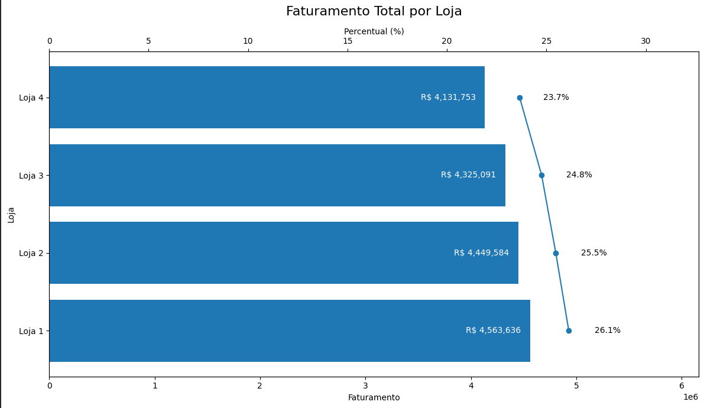
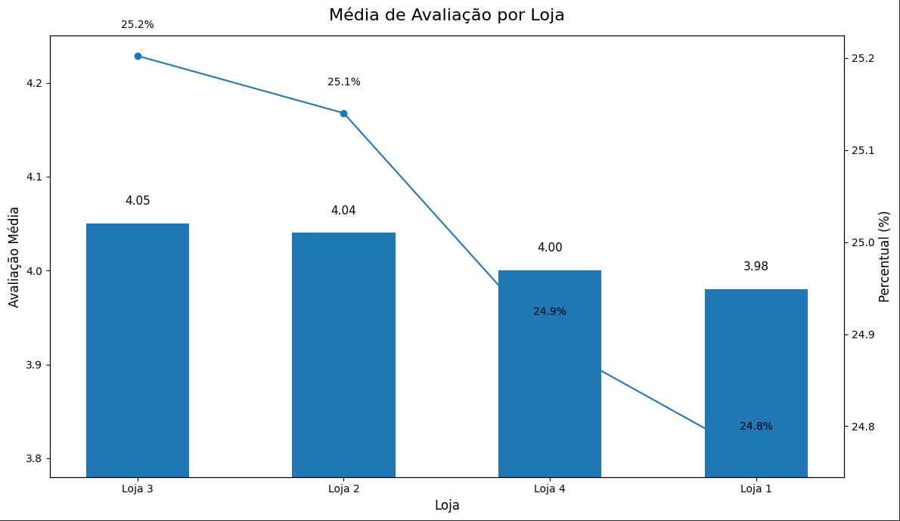
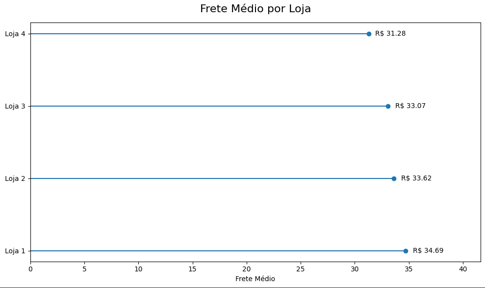

# 📊 Análise Estratégica de Performance | Alura Store

## 🧠 Visão Executiva

Este projeto apresenta uma análise estratégica de desempenho das quatro unidades da **Alura Store**, com o objetivo de apoiar uma decisão real de negócio:  

> **Qual loja deve ser vendida para otimizar a alocação de capital e maximizar eficiência do portfólio?**

A análise foi conduzida com foco executivo, utilizando indicadores financeiros, operacionais e de experiência do cliente para gerar uma recomendação orientada por dados.

Este projeto demonstra capacidade de:
✔  Pensamento analítico avançado  
✔  Interpretação estratégica de métricas  
✔  Comunicação executiva  
✔  Suporte à tomada de decisão baseada em dados  

---

# 🎯 Contexto de Negócio

O proprietário da empresa deseja vender uma das quatro lojas para levantar capital e investir em uma nova oportunidade estratégica.

Para evitar decisões baseadas apenas em percepção, foi estruturada uma análise comparativa considerando:

✔  Receita total por loja  
✔  Participação no faturamento consolidado  
✔  Avaliação média dos clientes  
✔  Eficiência logística (custo médio de frete)  
✔  Desempenho comercial por produto  

---

# 📊 Principais Métricas e Insights

## 💰 Faturamento Total

| Loja   | Faturamento (R$) | Participação |
|--------|------------------|--------------|
| Loja 1 | 4.563.636,11 | 26,12% |
| Loja 2 | 4.449.584,18 | 25,47% |
| Loja 3 | 4.325.091,42 | 24,76% |
| Loja 4 | 4.131.753,14 | 23,65% |

### 📈 Visualização do Faturamento



**Insight Estratégico:**  
A Loja 4 apresenta o menor faturamento absoluto e a menor participação no consolidado.  
A diferença para a Loja 1 supera R$ 430 mil, evidenciando menor contribuição financeira estrutural.

---

## ⭐ Avaliação Média dos Clientes

| Loja   | Nota Média |
|--------|------------|
| Loja 3 | 4,05 |
| Loja 2 | 4,04 |
| Loja 4 | 4,00 |
| Loja 1 | 3,98 |

### 📈 Visualização das Avaliações



**Insight Estratégico:**  
As notas são bastante próximas entre si.  
A Loja 4 mantém nível competitivo de satisfação, indicando que sua menor performance financeira não está associada à experiência do cliente.

---

## 🚚 Eficiência Logística (Frete Médio)

| Loja   | Frete Médio (R$) |
|--------|-------------------|
| Loja 4 | 31,28 |
| Loja 3 | 33,07 |
| Loja 2 | 33,62 |
| Loja 1 | 34,69 |

### 📈 Visualização do Frete Médio



**Insight Estratégico:**  
A Loja 4 possui o menor custo médio de frete, demonstrando eficiência operacional.  
No entanto, essa vantagem não compensa sua menor geração de receita.

---

# 🧠 Consolidação Estratégica

Ao integrar os indicadores:

- Receita foi priorizada como principal critério estratégico  
- Diferenças de avaliação foram estatisticamente pouco relevantes  
- Eficiência logística não compensou o menor faturamento  
- Não houve dominância comercial significativa que alterasse o ranking financeiro  

Sob a ótica de otimização de portfólio, a Loja 4 apresenta menor contribuição estratégica consolidada.

---

# ✅ Recomendação Executiva

Com base na análise comparativa, a **Loja 4 é a candidata mais racional para desinvestimento.**

### Justificativa:

- Menor faturamento total  
- Menor participação na receita consolidada  
- Baixo impacto reputacional (nota competitiva)  
- Eficiência operacional preservada nas demais unidades  

A venda da Loja 4 permite:

✔ Liberação de capital  
✔ Manutenção das unidades com maior geração de receita  
✔ Otimização estratégica do portfólio  

---

# 🗂 Estrutura do Projeto

```
Alura-Store-Analysis/
│
├── data/
│ ├── loja_1.csv
│ ├── loja_2.csv
│ ├── loja_3.csv
│ └── loja_4.csv
│
├── notebooks/
│ └── analise_alura_store.ipynb
│
├── images/
│ ├── faturamento.png
│ ├── avaliacao.png
│ └── frete.png
│
└── README.md
```


---

# ⚙️ Como Executar o Projeto

## 1️⃣ Clonar o repositório

```
git clone https://github.com/seu-usuario/alura-store-analysis.git
```


## 2️⃣ Instalar dependências

```
pip install pandas matplotlib
```

## 3️⃣ Executar o notebook
```
notebooks/analise_alura_store.ipynb
```

Pode ser executado:

Localmente via Jupyter Notebook

Ou no Google Colab

## 🛠 Stack Técnica

✔ Python

✔ Pandas

✔ Matplotlib

✔ Análise Exploratória de Dados (EDA)

✔ Métricas de Performance Financeira e Operacional

## 💼 Diferenciais do Projeto

Este projeto evidencia:

➡️ Capacidade de traduzir dados em decisão estratégica

➡️ Visão orientada a impacto de negócio

➡️ Organização e documentação profissional

➡️ Comunicação executiva de resultados

➡️ Estrutura analítica replicável

👩‍💻 Autora

Kelly Costa
Data Analyst | Business Intelligence | Estratégia Orientada por Dados


